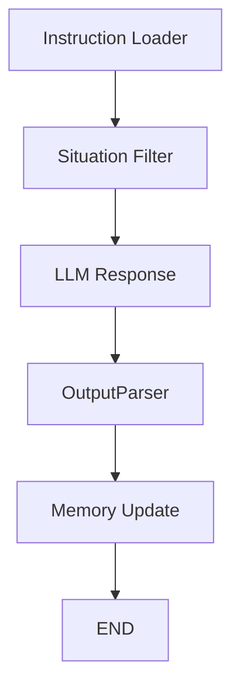

# Superon LangGraph 구조 문서/샘플/다이어그램

## 1. 전체 구조 다이어그램



---

## 2. 각 노드별 상세 예시 및 샘플 코드

### 1️⃣ Instruction Loader
- **설명**: 어드민 프롬프트(캐릭터 설명 등)를 로드하여 state에 저장
- **샘플 코드**:
```python
def instruction_loader(state: GraphState) -> GraphState:
    admin_instruction = "당신은 '사주오빠'라는 미소년 캐릭터입니다. 점을 잘 봅니다."
    state["instruction_prompt"] = admin_instruction
    return state
```
- **입출력 예시**:
  - 입력: `{}`
  - 출력: `{ "instruction_prompt": "당신은 ..." }`

---

### 2️⃣ Situation Filter
- **설명**: chat log에서 적합한 입력 선택
- **샘플 코드**:
```python
def situation_filter(state: GraphState) -> GraphState:
    chat_log = state.get("memory", {}).get("chat_log", [])
    selected_input = chat_log[-1]["content"] if chat_log else "사주오빠? 제 운세 봐주세요!"
    state["selected_input"] = selected_input
    return state
```
- **입출력 예시**:
  - 입력: `{ "memory": { "chat_log": [{"content": "오늘 운세?"}] } }`
  - 출력: `{ ..., "selected_input": "오늘 운세?" }`

---

### 3️⃣ LLM Response
- **설명**: instruction + input을 LLM에 전달, 응답 저장
- **샘플 코드**:
```python
from langchain_openai import ChatOpenAI
from langchain_core.prompts import ChatPromptTemplate
from langchain_core.output_parsers import StrOutputParser

llm = ChatOpenAI(model="gpt-4o")
prompt_template = ChatPromptTemplate.from_template(
    """
    {instruction_prompt}
    \n사용자 입력: {selected_input}\n\n캐릭터로서 자연스럽게 응답하세요. 응답 문장 마지막에 [감정: happy|sad|angry|neutral|surprise|disgust|fear] 형식으로 감정 태그를 붙이세요.
    """
)
llm_chain = prompt_template | llm | StrOutputParser()

def llm_response(state: GraphState) -> GraphState:
    response_text = llm_chain.invoke({
        "instruction_prompt": state["instruction_prompt"],
        "selected_input": state["selected_input"]
    })
    state["response_text"] = response_text
    return state
```
- **입출력 예시**:
  - 입력: `{ "instruction_prompt": "...", "selected_input": "오늘 운세?" }`
  - 출력: `{ ..., "response_text": "오늘은 좋은 일이... [감정: happy]" }`

---

### 4️⃣ OutputParser
- **설명**: LLM 응답에서 감정 태그 등 파싱
- **샘플 코드**:
```python
import re
def output_parser(state: GraphState) -> GraphState:
    text = state["response_text"]
    match = re.search(r"\[감정: (.*?)\]", text)
    emotion_tag = match.group(1) if match else "neutral"
    state["emotion_tag"] = emotion_tag
    return state
```
- **입출력 예시**:
  - 입력: `{ "response_text": "오늘은 ... [감정: happy]" }`
  - 출력: `{ ..., "emotion_tag": "happy" }`

---

### 5️⃣ Memory Update
- **설명**: 결과를 memory(state)에 저장 (DB 연동 등 확장 가능)
- **샘플 코드**:
```python
def memory_update(state: GraphState) -> GraphState:
    state["memory"] = {
        "last_response": state["response_text"],
        "last_emotion": state["emotion_tag"]
    }
    return state
```
- **입출력 예시**:
  - 입력: `{ "response_text": "...", "emotion_tag": "happy" }`
  - 출력: `{ ..., "memory": { "last_response": "...", "last_emotion": "happy" } }`

---

## 3. 전체 샘플 실행 코드 (통합)

```python
from typing import TypedDict, Dict, Any
from langchain_core.prompts import ChatPromptTemplate
from langchain_core.output_parsers import StrOutputParser
from langgraph.graph import END, StateGraph
from langchain_openai import ChatOpenAI
import re

default_memory = {}

class GraphState(TypedDict):
    instruction_prompt: str
    selected_input: str
    response_text: str
    emotion_tag: str
    memory: Dict[str, Any]

def instruction_loader(state: GraphState) -> GraphState:
    state["instruction_prompt"] = "당신은 '사주오빠'라는 미소년 캐릭터입니다. 점을 잘 봅니다."
    return state

def situation_filter(state: GraphState) -> GraphState:
    chat_log = state.get("memory", {}).get("chat_log", [])
    state["selected_input"] = chat_log[-1]["content"] if chat_log else "사주오빠? 제 운세 봐주세요!"
    return state

llm = ChatOpenAI(model="gpt-4o")
prompt_template = ChatPromptTemplate.from_template(
    """
    {instruction_prompt}
    \n사용자 입력: {selected_input}\n\n캐릭터로서 자연스럽게 응답하세요. 응답 문장 마지막에 [감정: happy|sad|angry|neutral|surprise|disgust|fear] 형식으로 감정 태그를 붙이세요.
    """
)
llm_chain = prompt_template | llm | StrOutputParser()

def llm_response(state: GraphState) -> GraphState:
    state["response_text"] = llm_chain.invoke({
        "instruction_prompt": state["instruction_prompt"],
        "selected_input": state["selected_input"]
    })
    return state

def output_parser(state: GraphState) -> GraphState:
    text = state["response_text"]
    match = re.search(r"\[감정: (.*?)\]", text)
    state["emotion_tag"] = match.group(1) if match else "neutral"
    return state

def memory_update(state: GraphState) -> GraphState:
    state["memory"] = {
        "last_response": state["response_text"],
        "last_emotion": state["emotion_tag"]
    }
    return state

def build_chat_graph():
    builder = StateGraph(GraphState)
    builder.add_node("load_instruction", instruction_loader)
    builder.add_node("filter_input", situation_filter)
    builder.add_node("llm_response", llm_response)
    builder.add_node("parse_output", output_parser)
    builder.add_node("update_memory", memory_update)
    builder.set_entry_point("load_instruction")
    builder.add_edge("load_instruction", "filter_input")
    builder.add_edge("filter_input", "llm_response")
    builder.add_edge("llm_response", "parse_output")
    builder.add_edge("parse_output", "update_memory")
    builder.add_edge("update_memory", END)
    return builder.compile()

# 실행 예시
graph = build_chat_graph()
state = {"memory": {"chat_log": [{"content": "오늘 운세 알려줘!"}]}}
for step in graph.stream(state):
    print(step)
```